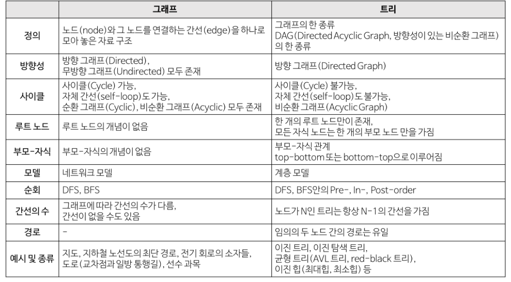
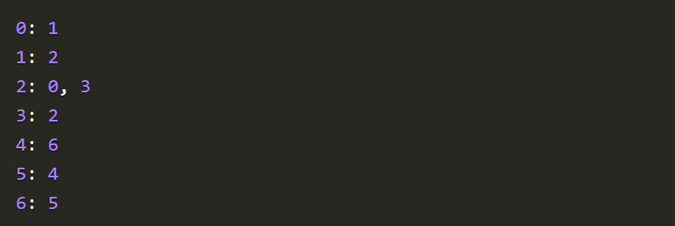

# Graph

## 개념

- 기본 개념

  - **노드**와 그 노드를 연결하는 **간선**을 하나로 모아 놓은 자료구조
  - 연결되어 있는 객체 간의 관계를 표현할 수 있는 자료구조
    - EX) 지도, 지하철 노선도, 전기회로 소자, 도로 등
  - 여러 개의 고립 그래프로 구성될 수 있음

- 관련 용어

  - 정점(vertex) : 위치의 개념 == node
  - 간선(edge) : 위치 간의 관계 즉, 노드를 연결하는 선 
  - 인접 정점 : 간선에 의해 직접 연결된 정점
  - 정점의 차수 : 무방향 그래프에서 하나의 정점에 인접한 정점의 수
    - 무방향 그래프에서 존재하는 정점의 모든 차수 합은 그래프 간선 수의 2배
  - 진입 차수 : 방향 그래프에서 외부에서 정점으로 오는 간선의 수 (내차수)
  - 진출 차수 : 방향 그래프에서 정점에서 외부로 나가는 간선의 수 (외차수)
    - 방향 그래프에 있는 정점의 진입차수 또는 진출차수의 합 = 방향 그래프 간선의 수 (내차수 + 외차수)
  - 경로 길이 : 경로를 구성하는 데 사용된 간선의 수
  - 단순 경로 : 경로 중 반복 정점이 없는 경우
  - 사이클 : 단순 경로의 시작 정점과 종료 정점이 동일한 경우
  - 오일러 경로 : 그래프에 존재하는 모든 간선을 한번만 통과하면서 처음 정점으로 되돌아 오는 경로
    - 그래프의 모든 정점에 연결된 간선의 개수가 짝수일 때만 오일러 경로가 존재한다.

- 종류

  - 무방향 그래프
    - 간선을 통해 양방향으로 이동 가능함
    - 정점 A와 정점 B를 연결하는 간선은 (A, B)와 같이 정점의 쌍으로 표현한다
      - (A ,B) == (B, A)
  - 방향 그래프
    - 간선에 방향이 존재해서 연결되어 있어도 특정 방향으로만 이동 가능
    - A->B로만 갈 수 있는 간선은 <A, B>로 표시함 

  - 가중치 그래프
    - 간선에 비용이나 가중치가 할당된 그래프
    - **네트워크**라고 함
  - 연결 그래프
    - 무방향 그래프에 있는 모든 정점 쌍에 대해 항상 경로가 존재하는 경우
  - 비연결 그래프
    - 무방향 그래프에서 특정 정점 쌍 사이에 경로가 존재하지 않는 경우 
    - 동 떨어진 정점이 존재함?
  - 순환 그래프 (사이클)
    - 단순 경로의 시작 정점과 종료 정점이 동일한 그래프
  - 비순환 그래프
    - 사이클이 없는 그래프
  - 완전 그래프
    - 그래프에 속해 있는 모든 정점이 서로 연결되어 있는 그래프
    - 무방향 완전 그래프
      - 정점의 개수 : n이면, 간선의 수 : n*(n-1) / 2

  

- 그래프와 트리 차이

  

## 특징

- 그래프는 네트워크 모델 이다.
- 2개 이상의 경로가 가능하다.
- 즉, 노드들 사이에 무방향/방향에서 양방향 경로를 가질 수 있다.
- self-loop 뿐 아니라 loop/circuit 모두 가능하다.
- 루트 노드라는 개념이 없다.
- 부모-자식 관계라는 개념이 없다.
- 순회는 DFS나 BFS로 이루어진다.
- 그래프는 순환(Cyclic) 혹은 비순환(Acyclic)이다.
- 그래프는 크게 방향 그래프와 무방향 그래프가 있다.
- 간선의 유무는 그래프에 따라 다르다

## 활용

- 지도
- 지하철 노선도
- 전기회로 소자들
- 도로
- 선수 과목

## 구현

> 인접리스트, 인접행렬

### 1) 인접 리스트

> 가장 일반적

- 개념 : 모든 정점을 인접 리스트에 저장한다. 즉, 각각의 정점에 인접한 정점들을 리스트로 표시한 것

  - 배열(혹은 해시 테이블)과 배열의 각 인덱스마다 존재하는 또 다른 리스트 (배열, 동적 가변 크기 배열), 연결 리스트를 이용하여 인접 리스트를 표현함

- ex)

  

- 적용 : 그래프 내에 적은 숫자의 간선만 가지는 희소 그래프의 경우
- 장점 
  - 어떤 노드에 인접한 노드를 쉽게 찾을 수 있다.
  - 그래프 사이 존재하는 모든 간선의 수는 O(N+E) 안에 알 수 있다
- 단점
  - 간선의 존재 여부와 정점의 차수 : 정점 i의 리스트에 있는 노드의 수 즉, 정점의 차수만큼의 시간이 필요

### 2) 인접행렬

- 개념 : 인접 행렬은 NxN 불린 행렬(Boolean Matrix)로써 matrix[i][j]가 true라면 i -> j로의 간선이 있다는 뜻이다.
- 적용 : 그래프에 간선이 많이 존재하는 밀집 그래프(Dense Graph) 의 경우

- 장점
  - 두 정점을 연결하는 간선의 존재 여부 (M`[i][j]`)를 O(1) 안에 즉시 알 수 있다.
  - 정점의 차수 는 O(N) 안에 알 수 있다. : 인접 배열의 i번 째 행 또는 열을 모두 더한다.

- 단점
  - 메모리 낭비 및 효율성이 떨어짐
  - 어떤 노드에 인접한 노드들을 찾기 위해서는 모든 노드를 전부 순회해야 한다.
  - 그래프에 존재하는 모든 간선의 수는 O(N^2) 안에 알 수 있다. : 인접 행렬 전체를 조사한다.

### 탐색

- DFS
- BFS

