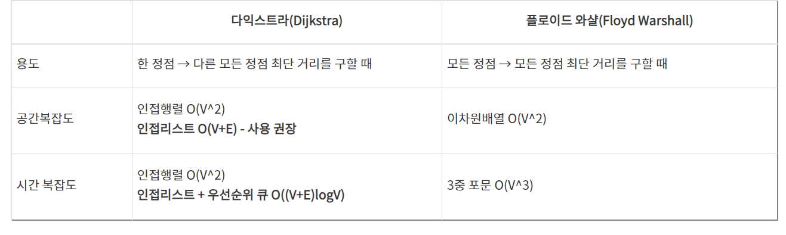

#  플로이드 워셜 

## 개념

- 모든 정점 사이의 최단 거리를 찾는 알고리즘
- 로직 및 과정
  - 하나의 정점에서 다른 정점으로 바로 갈 수 있으면 최소비용을, 없다면 INF(무한대)로 배열에 저장
  - 3중 for문을 통해 거쳐가는 정점을 설정한 후 해당 정점을 거쳐 비용을 줄이는 경우에만 최신화
  - 위 과정의 반복을 통해 최단 경로 탐색

- 다익스트라와 차이점
  - 다익스트라
    - 하나의 정점에서 출발해서 다른 모든 정점으로의 최단 경로를 구하는 알고리즘
  - 플로이드 와샬
    - 모든 정점에서 다른 모든 정점으로의 최단 경로를 구하는 알고리즘

