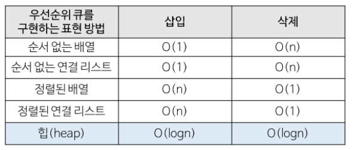

# heap

> 참고 : https://gmlwjd9405.github.io/2018/05/10/data-structure-heap.html


## 개념

- 우선순위 큐 : 우선순위의 개념을 큐에 도입한 자료구조
  - 데이터들이 우선순위를 가지고 있고 우선순위가 높은 데이터가 먼저 나간다.

- Heap : 완전이진트리의 일종으로 우선순위 큐를 위하여 만들어진 자료구조

- Heap의 종류

  - 최대 힙
    - 부모 노드의 키 값이 항상 자식 노드의 키 값보다 크거나 같은 완전 이진 트리
    - key(부모노드) >= key(자식노드)

  - 최소 힙

    - 부모 노드의 키 값이 항상 자식 노드의 키 값보다 작거나 같은 완전 이진 트리
    - key(부모노드) <= key(자식노드)

  - 예시

    


## 특징

- 여러 개의 값 중 최댓값이나 최솟값을 빠르게 찾아내기 위해 만들어진 자료구조
- 힙은 일종의 반정렬 상태(느슨한 정렬 상태)를 유지한다.
  - 큰 값이 상위 레벨에 있고 작은 값이 하위 레벨에 있는 정도만 정렬
  - 부모 노드의 값이 자식 노드의 값보다 항상 큰(작은) 이진 트리
- 힙 트리에서는 중복된 값을 허용한다.


## 활용

### 우선순위 큐

- 시뮬레이션 시스템
- 네트워크 트래픽 제어
- 운영체제에서의 작업 스케줄링
- 수치 해석적 계산


## 구현

- 우선순위 큐는 배열, 연결리스트, **힙**으로 구현할 수 있음
- 힙이 가장 효율적인

- 시간 복잡도

  

  

### Heap의 구현

- 힙을 저장하는 표준적인 자료구조는 배열이다.
- 구현을 쉽게 하기 위해 배열의 첫번째 인덱스인 0은 사용되지 않는다,
- 특정 위치의 노드 번호는 새로운 노드가 추가 되어도 변하지 않는다.

- 힙에서의 부모, 자식 노드 관계

  - 왼쪽 자식의 인덱스 =  (부모의 인덱스) * 2
  - 오른쪽 자식의 인덱스 = (부모의 인덱스) * 2 + 1

  - 부모의 인덱스 = 자식의 인덱스 / 2

  

- Python을 이용한 Heap 구현

  - heapq module

    ```python
        import heapq
        heap = [] 
        # 노드 추가
        heapq.heappush(heap, 1)
    
        # 노드 삭제 (root 노드 return)
        heapq.heappop(heap) 
    
        # 기존 리스트를 힙으로 변환
        heapq.heapify(tmp)
    ```

    

  - 구현

    - 삽입

      ```python
      def heappush(tr, value):
          tr.append(value)
          
          #현재 부모 노드?
          node = len(tr) - 1
          
          #현재 자식 노드 위치
          last_idx = node
          
          #노드가 1보다 클 때 반복 (1인 경우 루트노드임)
          while node > 1:
              
              #현재 노드를 부모 노드로 바꿔줌
              node //= 2
              
              #부모 노드가 크면, 부모 노드를 자식 노드에 저장함
              #현재 자식 노드 위치를 부모 노드로 업데이트
              if tr[node] > value:
                  tr[last_idx] = tr[node]
                  last_idx = node
              #부모 노드가 작을 경우 종료
              else:
                  break
          #현재 자식 노드 위치에 값 업데이트
          tr[last_idx] = value
          return
      ```

    - 삭제

      ```python
      #우선순위 판단을 위해 최소값의 위치를 찾아 출력
      def get_priority(tree, node):
          if len(tree) - 1 >= node*2 + 1:
              if tree[node*2] > tree[node*2 + 1]:
                  return node*2 + 1
              else:
                  return node*2
          elif len(tree) - 1 == node * 2:
              return node * 2
          
          else:
              return -1
              
      ```

      ```python
      #삭제
      def heappop(tree):
          # 아무것도 없음
          if len(tree) == 1:
              return 0
          
          return_value = tree[1]
          last_data = tree[-1]
          node = 1
          
          while:
              #우선순위가 높은 노드를 찾음
              prior_node = get_priority(tree, node)
              
              #자식 노드가 없는 경우 종료
              if prior_node == -1:
                  break
                  
              #자식 노드가 있고 나보다 우선순위가 높으면
              if last_data > tree[prior_node]:
                  #현재 노드에 자식 노드 값을 업데이트
                  tree[node] = tree[prior_node]
                  node = prior_node
              else:
                  break
          tree[node] = last_data
          tree.pop()
          
          return return_value
              
          
      ```

      

## 코테 연습

